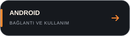

# SPECTRA 24 Android uygulaması

[](../README.md)
[](../docs/BUILD.md)

**v1.0.0 · versionCode 10 · Yerel Android arayüzü**

Bağımsız yerel Android uygulamasıdır; ESP32 içinde site ve uygulamada WebView
yoktur. Hedef Android 15 (API 35), minimum Android 8.0'dır (API 26).

## Canlı işlevler

- 126 noktalı waterfall ve anlık 2.400–2.525 GHz enerji profili
- Boyutu değişmeyen waterfall: sağa sürükleyerek 512 ölçümlük geçmiş, çift dokunarak canlıya dönüş
- Turuncu-siyah özel cihaz/olay pencereleri ve doğru seçili profil vurgusu
- Wi-Fi/TCP+UDP ve Bluetooth LE veri taşıma; otomatik geri dönüş
- UDP + BLE ile yakındaki SPECTRA cihazını bulma
- Telefon hotspot bilgisini BLE ile ESP32'ye verme ve yerel IP'ye geçme
- ESP32'nin canlı taramasından Wi-Fi erişim noktaları ve BLE reklamları
- Mevcut Wi-Fi kanalının yönetim/veri/kontrol çerçeve sayaçları
- Hassas, dengeli ve sakin algılama profilleri; ayrıntılı eşik/süre ayarları
- Seçilebilir telefon tonu, ses düzeyi, titreşim ve tekrar bekleme süresi
- Elle yeniden kalibrasyon ve canlı kaynak etiketi

## Ekran haritası

| Ekran | Ne için kullanılır? |
| --- | --- |
| Genel | RF özeti, waterfall, trafik ve olay geçmişi |
| Spektrum | Geçmiş inceleme, tepe izi, duraklatma ve tam ekran |
| Bağlantı | Wi-Fi/BLE keşif, hotspot ve bağlantı istatistikleri |
| Çevre radarı | Kategori seçimi, cihaz ayrıntıları, takma ad ve CSV |
| Ayarlar | Algılama profili, tarama örnekleri, ses ve titreşim |

Waterfall'daki bilgi düğmesi ölçümün nasıl yorumlanacağını açıklar.
Tam ekran aynı nokta boyutuyla daha fazla geçmiş gösterir; henüz ölçülmemiş
alan doldurulmaz. Çift dokunma canlı görünüme döndürür.

## Bağlanma

Uygulamanın **Bağlantı** sayfasından:

- **Otomatik bağlan:** Wi-Fi ve BLE denenir; TCP/UDP bulunursa önceliklidir.
- **Hızlı Wi-Fi:** Android bağlantı isteğini onaylayın. Elle bağlantı için
  Wi-Fi ayarlarında `SPECTRA-24` / `spectrum24` ağı kullanılabilir.
- **Bluetooth LE:** Wi-Fi değiştirmeden doğrudan cihaza bağlanır.
- **Telefon hotspot'u:** hotspot'u açın, SSID/parolayı girip ESP32'ye gönderin.
  BLE bağlantısı, ESP32'nin yeni IP adresini uygulamaya bildirir.
- **Elle IP:** ESP32 başka bir yerel ağdaysa adresini doğrudan girebilirsiniz.

Android'in istediği yakın cihaz, Bluetooth ve bildirim izinlerini verin. Doğrudan
ESP32 ağı internet sunmadığı için Android “bağlı kal” sorarsa onaylayın.

## Alarm ve kapatma

ESP32 kalibrasyon sırasında alarm üretmez. Sonrasında yalnızca adaptif tabana
göre yaygın ve sürekli RF artışı bildirilir. Uygulama aynı olayı tekrar
çalmamak için kendi cooldown denetimini de uygular.

Android geri/ana ekran hareketi uygulamayı arka plana alabilir. Tam kapatmak için
Ayarlar'daki **Ölçümü durdur ve uygulamadan çık** veya bildirimdeki **Durdur** düğmesini kullanın; servis,
soketler, BLE taraması ve bildirim birlikte sonlandırılır.

**Uyarıyı dene** seçili ses ve açık olan titreşimi dener; titreşim anahtarı anında
kaydedilir. Android titreşim/rahatsız-etmeyin politikaları geçerlidir.

## Derleme ve bilgisayarda test

```bash
./gradlew assembleDebug
```

Ana klasördeki `./build.sh android` APK'yı `dist/` altına çıkarır.
`./build.sh emulator`, APK'yı Android 15 emülatöre kurar. Bu
testte veriler `tools/device_simulator.py` tarafından üretilir; arayüzde turuncu
`DEMO` ve `SENTETİK DEMO` etiketleri vardır, waterfall filigranlıdır ve alarm sesi
devre dışıdır. Gerçek kullanım modu bu kaynağa kendiliğinden geçmez.
