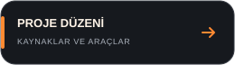

# Dosya düzeni

**v1.0.0** — kaynak, belge ve üretilen çıktılar birbirinden ayrıdır.

- `build.sh`: etkileşimli menü ve otomasyon için ortak CLI.
- `scripts/`: Android/ESP32 derleme, yükleme, SDK kurulumu ve test başlatıcıları.
- `android-app/app/src/main/`: Android kaynakları, kaynak değerleri ve Font Awesome.
- `android-app/app/src/androidTest/`: Android model/izin/UI testleri.
- `android-app/gradle/wrapper/`: Wrapper ayarları ve gerekli JAR; build artığı değildir.
- `firmware/`: bağımsız PlatformIO projesi; `src/main.cpp` cihaz yazılımıdır.
- `firmware/docs/PROTOCOL.md`: uygulama/cihaz veri protokolü.
- `tools/`: simülatör, kaynak/model/UI testleri, paylaşım/temizlik aracı.
  Sürüm numaralı eski UI testleri regresyon testidir; korunur.
- `docs/`: derleme rehberi, düzen ve tarihsel test notları.
- `THIRD_PARTY_NOTICES.md`: bağımlılık ve font lisansı kaynakları.
- `LICENSE.md`: PolyForm Noncommercial 1.0.0 tam metni.
- `docs/assets/`: README başlığı ve bağlantı düğmeleri; çevrimdışı çalışan SVG'ler.
- `release/`: yerel APK/BIN ve kaynak arşivleri; yalnız README Git'e dahil edilir.
- `release/screenshots/`: testte yeniden oluşturulan görseller; paylaşım paketine girmez.
- `.run/`, `.pio/`, `.gradle/`, `build/`: yeniden üretilebilir, Git dışında tutulan çıktılar.

Bu klasör başka bir kullanıcı/konumda derlenebilir; sabit kişisel proje yolu
gerektirmez. IDE'de ayrı bir firmware kopyası kullanılıyorsa otomatik eşitleme
yoktur. GitHub için tek kaynak olarak buradaki `firmware/` dizinini kullanın.
